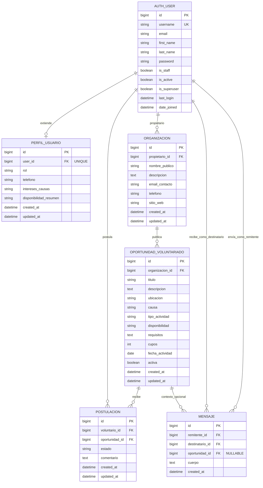

# Mano a mano — DER y Modelo Relacional

## 1. Diagrama entidad–relación (DER)

---

## 2. Modelo relacional

### Tabla auth_user

Defecto de Django, las columnas corresponde al modelo "User" de Django.

### Tabla `perfil_usuario`

| Columna | Tipo | Clave / Restricción |
|---------|------------|---------------------|
| id | BIGINT AUTO_INCREMENT | PK |
| user_id | BIGINT | FK auth_user(id), UNIQUE, ON DELETE CASCADE |
| rol | VARCHAR(3) | NOT NULL |
| telefono | VARCHAR(40) | BLANK |
| intereses_causas | VARCHAR(255) | BLANK |
| disponibilidad_resumen | VARCHAR(255) | BLANK |
| created_at | DATETIME(6) | NOT NULL |
| updated_at | DATETIME(6) | NOT NULL |

### Tabla `organizacion`

| Columna | Tipo | Clave / Restricción |
|---------|------------|---------------------|
| id | BIGINT AUTO_INCREMENT | PK |
| propietario_id | BIGINT | FK auth_user(id), ON DELETE CASCADE |
| nombre_publico | VARCHAR(200) | NOT NULL |
| descripcion | LONGTEXT | BLANK |
| email_contacto | VARCHAR(254) | NOT NULL |
| telefono | VARCHAR(40) | BLANK |
| sitio_web | VARCHAR(200) | BLANK |
| created_at | DATETIME(6) | NOT NULL |
| updated_at | DATETIME(6) | NOT NULL |

### Tabla `oportunidad_voluntariado`

| Columna | Tipo MySQL | Clave / Restricción |
|---------|------------|---------------------|
| id | BIGINT AUTO_INCREMENT | PK |
| organizacion_id | BIGINT | FK organizacion(id), ON DELETE CASCADE |
| titulo | VARCHAR(200) | NOT NULL |
| descripcion | LONGTEXT | NOT NULL |
| ubicacion | VARCHAR(200) | NOT NULL |
| causa | VARCHAR(120) | NOT NULL |
| tipo_actividad | VARCHAR(120) | NOT NULL |
| disponibilidad | VARCHAR(200) | NOT NULL |
| requisitos | LONGTEXT | BLANK |
| cupos | INT UNSIGNED | NOT NULL |
| fecha_actividad | DATE | NULL |
| activa | TINYINT(1) | NOT NULL |
| created_at | DATETIME(6) | NOT NULL |
| updated_at | DATETIME(6) | NOT NULL |

### Tabla `postulacion`

| Columna | Tipo MySQL | Clave / Restricción |
|---------|------------|---------------------|
| id | BIGINT AUTO_INCREMENT | PK |
| voluntario_id | BIGINT, UNIQUE | FK auth_user(id), ON DELETE CASCADE |
| oportunidad_id | BIGINT, UNIQUE | FK oportunidad_voluntariado(id), ON DELETE CASCADE |
| estado | VARCHAR(3) | NOT NULL |
| comentario | LONGTEXT | BLANK |
| created_at | DATETIME(6) | NOT NULL |
| updated_at | DATETIME(6) | NOT NULL |

### Tabla `mensaje`

| Columna | Tipo MySQL | Clave / Restricción |
|---------|------------|---------------------|
| id | BIGINT AUTO_INCREMENT | PK |
| remitente_id | BIGINT | FK auth_user(id), ON DELETE CASCADE |
| destinatario_id | BIGINT | FK auth_user(id), ON DELETE CASCADE |
| oportunidad_id | BIGINT | FK oportunidad_voluntariado(id), NULL, ON DELETE SET NULL |
| cuerpo | LONGTEXT | NOT NULL |
| created_at | DATETIME(6) | NOT NULL |

---