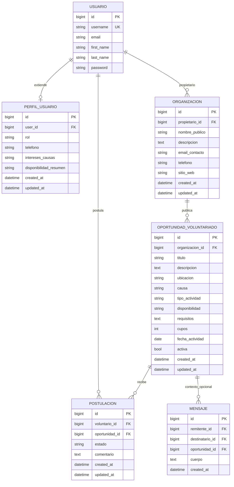
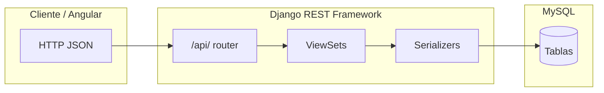

# Mano a mano — DER, modelo relacional y backend EV2

Documentación para **Programador Web · EV2 Sprint 1**: diagrama entidad–relación (DER), modelo relacional para **MySQL**, script SQL de referencia y alineación con la **API REST (Django REST Framework)**.

Los gráficos usan **[Mermaid](https://mermaid.js.org/)** (código dentro del Markdown). Se visualizan en GitHub, GitLab, VS Code (Markdown preview con Mermaid), Obsidian, etc.

---

## 1. Diagrama entidad–relación (DER)

Entidad **Usuario** mapeada a la tabla **`auth_user`** de Django. Atributos y relaciones principales; cardinalidad en convención Mermaid (`||` uno exacto, `o|` cero o uno, `o{` cero o muchos).

Las FK **`remitente_id`** y **`destinatario_id`** de `mensaje` apuntan cada una a **`auth_user.id`** (cardinalidad **N : 1** respecto de `USUARIO` en ambos casos). No se dibujan como dos líneas separadas hacia `USUARIO` para evitar errores de render en algunos visores Mermaid; la tabla física en la sección 2.6 las detalla.

### 1.1 Cardinalidades (resumen)

| Relación | Cardinalidad | Descripción |
|----------|--------------|-------------|
| Usuario ↔ PerfilUsuario | **1 : 0..1** | Cada fila de perfil referencia exactamente un usuario (`user_id` UNIQUE). |
| Usuario ↔ Organizacion | **1 : 0..N** | Un usuario puede ser propietario de varias organizaciones (`propietario_id` FK sin unicidad). |
| Organizacion ↔ OportunidadVoluntariado | **1 : N** | Una organización publica muchas oportunidades. |
| OportunidadVoluntariado ↔ Postulacion | **1 : N** | Una oportunidad admite muchas postulaciones. |
| Usuario (voluntario) ↔ Postulacion | **1 : N** | Un usuario puede postularse a varias oportunidades. |
| (voluntario, oportunidad) | **Única** | No se duplica la postulación del mismo usuario a la misma oportunidad. |
| OportunidadVoluntariado ↔ Mensaje | **1 : N (opcional)** | `oportunidad_id` puede ser `NULL`. |
| Usuario ↔ Mensaje (remitente) | **1 : N** | Muchos mensajes enviados por el mismo usuario (`remitente_id`). |
| Usuario ↔ Mensaje (destinatario) | **1 : N** | Muchos mensajes recibidos por el mismo usuario (`destinatario_id`). |

### 1.2 Atributos vs filtrado REST en oportunidades

En la tabla `oportunidad_voluntariado`, las columnas **`ubicacion`**, **`causa`**, **`tipo_actividad`** y **`disponibilidad`** describen la convocatoria y se editan por **CRUD** vía API y formularios del panel. **No** forman parte de los parámetros `GET` del listado `/api/oportunidades/` en la implementación actual.

Los únicos **query params** soportados para filtrar listados son:

- **`activa`**: acota por bandera booleana (interpretación de valores truthy/falsy en `views.py`).
- **`organizacion`**: id numérico de la organización publicante.

Cualquier futura búsqueda por texto (p. ej. por ubicación o causa) debe especificarse como RF/HU nueva y reflejarse en front, back y este documento.

### 1.3 Cliente Angular (estructura de carpetas · alineación con código)

Ubicación: `Frontend/src/app/` (referencia rápida para trazabilidad documental).

| Carpeta | Rol |
|---------|-----|
| `pages/` | Componentes por ruta: inicio, login, dashboard, quienes-somos. |
| `shared/` | Componentes reutilizables (navbar, footer), constantes compartidas. |
| `services/` | Servicios HTTP, autenticación y sesión (`ManoApiService`, `AuthService`, `SessionService`). |
| `core/` | Infra transversal: `guards`, `interceptors`, `tokens` (URL base API). |
| `models/` | Tipos TypeScript alineados a los serializers Django. |

---

## 2. Modelo relacional (tablas, PK, FK)

Nombres físicos = `Meta.db_table` en Django (`api/models.py`).

### 2.1 `auth_user` (Django)

Creada por migraciones `auth`. Clave primaria **`id`**. El resto de columnas corresponde al modelo `User` de Django.

### 2.2 `perfil_usuario`

| Columna | Clave / tipo |
|---------|----------------|
| **id** | PK, BIGINT |
| **user_id** | FK → `auth_user(id)`, UNIQUE, ON DELETE CASCADE |
| rol, telefono, intereses_causas, disponibilidad_resumen | |
| created_at, updated_at | DATETIME(6) |

### 2.3 `organizacion`

| Columna | Clave / tipo |
|---------|----------------|
| **id** | PK, BIGINT |
| **propietario_id** | FK → `auth_user(id)`, ON DELETE CASCADE |
| nombre_publico, descripcion, email_contacto, telefono, sitio_web | |
| created_at, updated_at | DATETIME(6) |

### 2.4 `oportunidad_voluntariado`

| Columna | Clave / tipo |
|---------|----------------|
| **id** | PK, BIGINT |
| **organizacion_id** | FK → `organizacion(id)`, ON DELETE CASCADE |
| titulo, descripcion, ubicacion, causa, tipo_actividad, disponibilidad, requisitos, cupos, fecha_actividad, activa | |
| created_at, updated_at | DATETIME(6) |

### 2.5 `postulacion`

| Columna | Clave / tipo |
|---------|----------------|
| **id** | PK, BIGINT |
| **voluntario_id** | FK → `auth_user(id)`, ON DELETE CASCADE |
| **oportunidad_id** | FK → `oportunidad_voluntariado(id)`, ON DELETE CASCADE |
| estado, comentario, created_at, updated_at | |
| **(voluntario_id, oportunidad_id)** | UNIQUE |

### 2.6 `mensaje`

| Columna | Clave / tipo |
|---------|----------------|
| **id** | PK, BIGINT |
| **remitente_id** | FK → `auth_user(id)`, ON DELETE CASCADE |
| **destinatario_id** | FK → `auth_user(id)`, ON DELETE CASCADE |
| **oportunidad_id** | FK → `oportunidad_voluntariado(id)`, NULL permitido, ON DELETE SET NULL |
| cuerpo, created_at | |

---

## 3. Script MySQL

Archivo: [`mysql_schema_manoamano.sql`](./mysql_schema_manoamano.sql).

Incluye `CREATE TABLE` para las tablas de negocio con claves foráneas hacia **`auth_user`**. Es requisito haber ejecutado antes **`python manage.py migrate`** en la misma base para crear `auth_user` y el resto del esquema Django, **o** adaptar el script si la cátedra pide un volcado autónomo (solo tablas custom).

La fuente de verdad para el despliegue con Django sigue siendo **`api/migrations/`** + `migrate`.

---

## 4. Rutas locales (`/api/`)

| Recurso | Ruta | Operaciones |
|---------|------|-------------|
| Health | `GET /api/health/` | Estado del servicio (operaciones / scripts; no invocado desde el SPA). |
| Usuarios | `/api/usuarios/` | **GET** lista · **POST** alta; sin detalle/edición/eliminación por API. |
| PerfilUsuario (tabla `perfil_usuario`) | *Admin Django* | Sin ViewSet REST: el SPA no consumía `/api/perfiles/`. Los datos siguen existiendo para futuro uso o admin. |
| Organizaciones | `/api/organizaciones/` | CRUD REST + query opcional: **`propietario`** (id de usuario Django) |
| Oportunidades | `/api/oportunidades/` | CRUD + query: **`activa`**, **`organizacion`** (id); el cliente Angular solo usa esos filtros |
| Postulaciones | `/api/postulaciones/` | **GET** lista + filtros · **POST** · **PATCH**; sin **DELETE** en API |
| Mensajes | `/api/mensajes/` | Solo **POST** crear; sin listado REST genérico ni **DELETE**. |
| Bandeja | `GET /api/mensajes/bandeja/?usuario=<id>` | Recibidos y enviados |

Raíz del proyecto: `http://127.0.0.1:8000/` · Admin: `/admin/`.

---

## 5. Códigos HTTP (EV2)

| Código | Uso |
|--------|-----|
| **200** | GET list/detail OK; PUT/PATCH OK; health; bandeja con usuario válido. |
| **201** | POST creación exitosa. |
| **204** | DELETE exitoso. |
| **400** | Validación de serializer; JSON inválido; falta `usuario` en bandeja; postulación duplicada (unicidad). |
| **404** | Recurso con `pk` inexistente; usuario inexistente en bandeja. |

---

## 6. Serializadores por modelo

| Modelo | Serializer |
|--------|------------|
| User | `UserSerializer`, `UserCreateSerializer` |
| PerfilUsuario | *Sin serializer REST* (solo modelo + admin Django) |
| Organizacion | `OrganizacionSerializer` |
| OportunidadVoluntariado | `OportunidadVoluntariadoSerializer` |
| Postulacion | `PostulacionSerializer` |
| Mensaje | `MensajeSerializer` |

Código: `api/serializers.py`.

---

## 7. Vista rápida cliente → API → MySQL (Mermaid)

---

*Proyecto **Mano a mano** — Red de voluntarios (ISPC · Proyecto Integrador II).*
